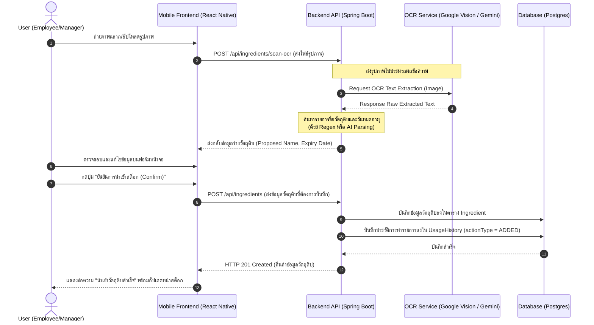
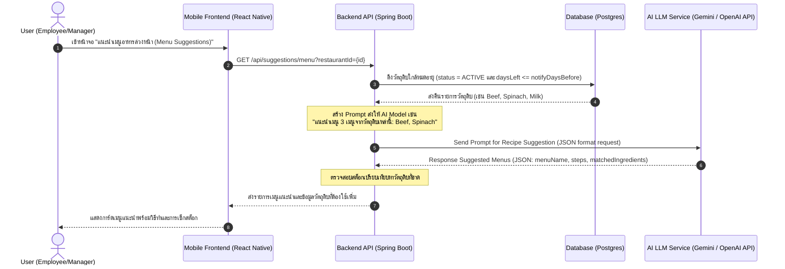
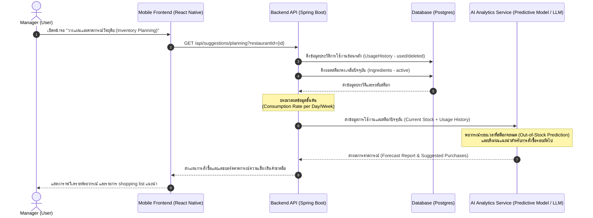

# Sequence Diagrams: OCR Import & AI Features

เอกสารนี้รวบรวม **Mermaid Plaintext Code** ของ Sequence Diagram สำหรับการทำงานหลัก 3 ส่วน ได้แก่:
1. การนำเข้าวัตถุดิบด้วย OCR (Stock OCR Import)
2. การแนะนำเมนูอาหารจากวัตถุดิบใกล้หมดอายุด้วย AI (AI Menu Suggestion)
3. การวิเคราะห์วางแผนและคาดการณ์วัตถุดิบด้วย AI (AI Ingredient Planning & Forecasting)

คุณสามารถนำโค้ดบล็อกเหล่านี้ไปวางในโปรแกรมที่รองรับ Mermaid (เช่น GitHub, Notion, Obsidian, หรือ [Mermaid Live Editor](https://mermaid.live)) เพื่อแสดงผลเป็นแผนภาพได้ทันที

---

## 1. การนำเข้าวัตถุดิบด้วย OCR (Stock OCR Import Flow)

กระบวนการสแกนรูปภาพฉลากหรือใบเสร็จเพื่อตรวจจับวันหมดอายุและบันทึกเข้าสู่คลังสต็อก

---

## 2. การแนะนำเมนูอาหารจากวัตถุดิบใกล้หมดอายุด้วย AI (AI Menu Suggestion Flow)

กระบวนการใช้ AI ดึงข้อมูลวัตถุดิบที่ใกล้หมดอายุในระบบมาคิดไอเดียเมนูอาหาร เพื่อลดขยะอาหาร (Food Waste)

---

## 3. การวางแผนและคาดการณ์วัตถุดิบด้วย AI (AI Ingredient Planning & Forecasting Flow)

กระบวนการพยากรณ์ปริมาณการใช้วัตถุดิบและแจ้งเตือนวันที่ควรสั่งซื้อของเพิ่ม (Restocking Plan) โดยคำนวณจากประวัติการใช้และอัตราความเร็วในการหมดของวัตถุดิบ

